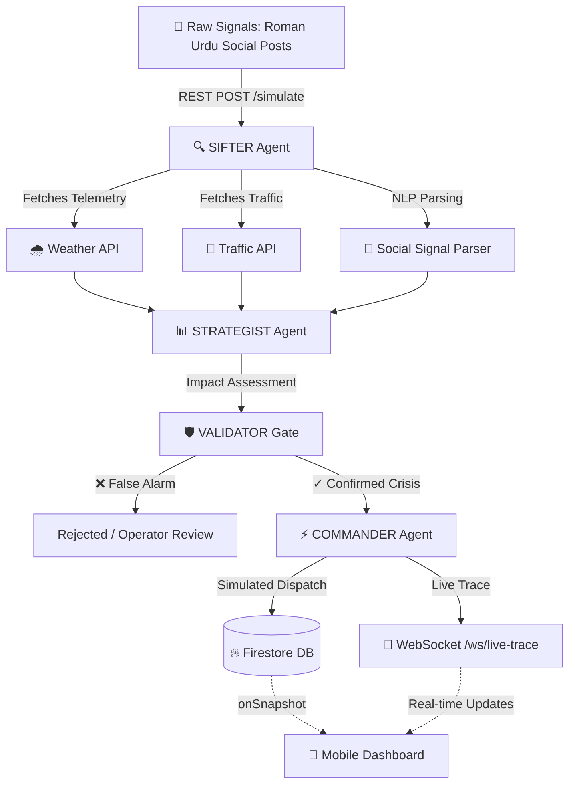

# CIRO — Crisis Intelligence & Response Orchestrator

> **AISeekho 2026 · Challenge 3 · Crisis Intelligence & Response Orchestrator**

A **production-oriented prototype** for Karachi urban crisis detection, multi-signal validation, and municipal response orchestration — powered by **Google Gemini AI** and built with **Google Antigravity** as the principal development orchestrator.

> **⚠️ Note to Judges:** CIRO is a demonstration prototype. All dispatch packages (suction pumps, rescue units, traffic diversions) are **simulated** and require **operator/supervisor approval** before theoretical execution. Public alert messages are **operator-reviewable drafts**, not live broadcasts.

---

## 📱 Demo Links

| Deliverable | Link |
|:---|:---|
| **Mobile App (APK)** | _[Insert Google Drive link to CIRO-Mobile-Demo.apk]_ |
| **GitHub Repository** | _[Insert GitHub URL]_ |
| **Main Demo Video (3–5 min)** | _[Insert YouTube/Drive link]_ |
| **Antigravity Usage Video (2–3 min)** | _[Insert YouTube/Drive link]_ |
| **Web Dashboard** | _[Insert deployment URL or localhost:8000/static/index.html]_ |
| **Antigravity Trace ZIP** | _[Insert Drive link to CIRO-Antigravity-Traces.zip]_ |

---

## 🎯 Challenge Alignment

| Hackathon Criteria | CIRO Implementation |
|:---|:---|
| **Crisis Detection** | Parses Roman Urdu social posts via SifterAgent with deterministic + Gemini NLP. |
| **Multi-Signal Fusion** | Fuses social sentiment with weather telemetry and traffic congestion data. |
| **Confidence Scoring** | ValidatorGate computes structural confidence (0.0–1.0) with evidence breakdown. |
| **False-Positive Handling** | ValidatorGate catches contradictions, weak signals, and spam attacks. |
| **Resource Allocation** | CommanderAgent generates prioritized simulated dispatch packages. |
| **Stakeholder Messaging** | Dynamic, localized alert drafts (Roman Urdu/English) requiring operator approval. |
| **Real-Time Dashboards** | Live WebSocket agent trace streaming + Google Maps command interface. |
| **Degraded Mode** | Automatic mock fallback when external APIs are unavailable. |
| **Mobile App** | Capacitor-wrapped APK with offline demo mode for judge testing. |
| **Antigravity Integration** | Main development orchestrator — architecture, code, evidence, documentation. |

---

## 🤖 Google Antigravity as Main Orchestrator

**Google Antigravity** served as the **principal development orchestrator** for CIRO. It was used for:

- **Architecture Planning** — Designed the multi-agent pipeline, Firestore schema, and WebSocket protocol.
- **Code Generation & Hardening** — Authored and hardened all Python agents, FastAPI routes, and safety gates.
- **Frontend Engineering** — Built the mobile-first command dashboard with offline simulation engine.
- **Safety Logic** — Implemented ValidatorGate structural validation with 5 scenario coverage.
- **Evidence Generation** — Generated 20+ evidence files for judge verification.
- **README Authoring** — This document was authored and hardened by Antigravity.
- **Mobile Packaging** — Configured Capacitor for Android APK generation.
- **Final Audit** — Performed security review, consistency check, and submission preparation.

See `docs/antigravity-trace-pack/` for complete trace evidence.

---

## 📱 Mobile Application

CIRO's frontend is a **mobile-first** crisis command interface packaged with **CapacitorJS**.

### Network Modes
The app automatically detects and adapts to network conditions:

| Mode | Badge Color | Description |
|:---|:---|:---|
| **LIVE BACKEND** | 🟢 Green | Connected to deployed production server |
| **LOCAL BACKEND** | 🔵 Blue | Connected to localhost / emulator loopback |
| **MOCK FALLBACK** | 🟣 Purple | Backend reachable but running in simulation mode |
| **OFFLINE DEMO** | 🟠 Orange | No backend — full client-side simulation active |

### Offline Demo Mode
When no backend is reachable (e.g., judge testing on a real phone), the app activates a **full client-side simulation engine** supporting all 4 demo scenarios with animated agent traces, scorecard updates, map markers, result overlays, and alert notifications.

See `MOBILE_INSTALL.md` for build instructions.

---

## 🏗️ Architecture



---

## 🔄 Multi-Agent Pipeline

Four specialized AI agents execute sequentially with full trace logging:

### 1. SifterAgent
- Ingests raw Roman Urdu social posts
- Queries weather and traffic APIs (or mock fallbacks)
- Computes multi-source severity (1–10) and confidence (0.0–1.0)
- Classifies event type: `monsoon_flooding` or `summer_heatwave_power_failure`
- Uses **Gemini 3 Flash-Preview** for reasoning or deterministic fallback

### 2. StrategistAgent
- Cross-validates incident with fresh data sources
- Calculates affected population using geofence density estimation
- Determines rerouting needs based on congestion thresholds
- Generates alternative routes with estimated delays
- Produces mitigation strategy (Gemini-powered or rule-based)

### 3. ValidatorGate (Safety Gate)
- Structural validation to catch false alarms before dispatch
- Returns rich validation JSON with status, confidence, evidence, and fallback flags
- Handles 5 core scenarios (see below)

### 4. CommanderAgent
- Generates simulated dispatch packages (OPERATOR APPROVAL REQUIRED)
- Creates emergency tickets for high-severity incidents
- Produces operator-reviewable public alert drafts
- Activates geofence warning zones
- Pushes live updates via WebSocket

---

## 🛡️ ValidatorGate — False-Positive & Safety Handling

The ValidatorGate returns a structured safety validation result:

```json
{
  "validated": true,
  "requires_review": false,
  "fallback_mode": false,
  "reason": "Confirmed",
  "confidence": 0.96,
  "evidence": {
    "rainfall_mm": 50,
    "congestion_level": 9,
    "social_score": 0.85,
    "source_consistency": "all_aligned",
    "telemetry_available": true
  }
}
```

### Decision Matrix

| Scenario | Social Signal | Rainfall | Traffic | Output |
|:---|:---|:---|:---|:---|
| **Confirmed Flood** | Strong Roman Urdu report | ≥10mm | High (≥6) | `validated=true, status=confirmed` |
| **Weak Signal** | Vague / low score | <10mm | Normal | `requires_review=true` or `false_alarm` |
| **Missing Telemetry** | Any | API unavailable | API unavailable | `fallback_mode=true, requires_review=true` |
| **Contradiction** | Strong flood report | 0mm | Normal | `requires_review=true, reason=contradiction` |
| **Multi-Crisis** | Multiple events | Varies | Varies | Prioritized response package |

---

## 📡 Signal Fusion & Confidence Scoring

CIRO does not rely on a single data source. Social signals ("pani bhar gaya") are treated as **indicators**, not ground truth.

**Scoring Components:**
- Weather: 0–4.0 points based on rainfall_mm thresholds (5/10/30/50mm)
- Traffic: 0–3.0 points based on congestion level (4/6/8+)
- Social: 0–3.0 points based on aggregate NLP score (0.4/0.7+)
- Penalty: -1.5 for high false alarm counts

**Confidence** = normalized composite score + 0.1 per confirmed source (capped at 0.99)

---

## 🚨 Resource Allocation Logic (Simulated)

Based on severity and crisis type, the CommanderAgent generates a **simulated dispatch package**:

| Severity | Assets | Label |
|:---|:---|:---|
| 9–10 (Critical) | Full emergency response, rescue teams, PDMA/NDMA coordination | SIMULATED — OPERATOR APPROVAL REQUIRED |
| 7–8 (High) | Water pumping units, traffic advisory, SMS + push alerts | SIMULATED — OPERATOR APPROVAL REQUIRED |
| 4–6 (Medium) | Monitor for escalation, traffic management alert | SIMULATED — OPERATOR APPROVAL REQUIRED |
| 1–3 (Low) | Weather advisory, no immediate action | SIMULATED — OPERATOR APPROVAL REQUIRED |

---

## 📢 Stakeholder Notification (Simulated)

Alert messages are dynamically generated by the CommanderAgent (Gemini-powered or rule-based fallback), tailored to the specific zone and crisis type. Example:

> "URGENT: Active flooding confirmed near University Road, Karachi. Avoid the area. Use M.A. Jinnah Road as alternate route. Drainage pumps dispatched."

**All stakeholder notifications are operator-reviewable drafts, not live broadcasts.**

---

## 🔌 API Surface

| Method | Path | Description |
|:---|:---|:---|
| `GET` | `/` | Root health check |
| `GET` | `/health` | System health with status JSON |
| `POST` | `/simulate` | Trigger full multi-agent simulation |
| `GET` | `/incidents` | Retrieve all detected incidents |
| `GET` | `/alerts` | Retrieve all generated alerts |
| `GET` | `/traces` | Retrieve agent reasoning traces |
| `GET` | `/live-status` | Agent status, store summary, connection count |
| `WS` | `/ws/live-trace` | Real-time agent trace stream |

### POST /simulate — Request Body
```json
{
  "location": "University Road",
  "social_posts": ["pani bhar gaya gari phas gayi emergency"],
  "rainfall_mm": 50,
  "congestion_level": 9
}
```

---

## 🔥 Firestore Schema

Database: `cirokhi` (Firebase Firestore)

### Collections

| Collection | Document ID | Key Fields |
|:---|:---|:---|
| `incidents` | `{incident_id}` | event_type, location, severity, confidence, raw_signals, timestamp |
| `alerts` | `{incident_id}` | message, severity, location, actions, channels, geofence_km |
| `reasoning_traces` | `{session_id}` | started_at, status, reasoning_trace[], errors[] |
| `simulations` | `{incident_id}` | priority, affected_population, alternative_routes, mitigation_strategy |
| `agent_logs` | `{auto_id}` | agent, event, data, timestamp |

---

## 📡 WebSocket Trace Schema

Agent reasoning is streamed as JSON over `/ws/live-trace`:

```json
{
  "type": "trace",
  "agent": "COMMANDER",
  "message": "Dispatching 3 drainage pumps to University Road. Geofence zone: 2.5km radius.",
  "timestamp": "2026-05-20T02:30:00.000Z",
  "session_id": "uuid"
}
```

Status updates:
```json
{
  "type": "status",
  "status": "confirmed",
  "session_id": "uuid"
}
```

---

## 🔄 Mock vs Real API Table

| Subsystem | `SIMULATION_MODE=true` (Demo) | `SIMULATION_MODE=false` (Live) |
|:---|:---|:---|
| **Weather** | Rule-based rainfall estimation | Meteosource API / Google Weather |
| **Traffic** | Deterministic congestion mapping | TomTom API / Google Routes |
| **Social NLP** | Keyword-based Roman Urdu parser | Gemini 3 Flash-Preview NLP |
| **AI Reasoning** | Deterministic rule-based scoring | Google Gemini 3 Flash-Preview |
| **Database** | In-memory Python dict (`_mem_store`) | Firebase Firestore (`cirokhi`) |
| **Dispatch** | Simulated (operator approval required) | Simulated (operator approval required) |

---

## 🛡️ Safety Boundary

CIRO enforces strict safety boundaries:

- **No autonomous dispatch.** All dispatch packages are simulated and require operator approval.
- **No live public alerts.** All alert messages are operator-reviewable drafts.
- **False alarm protection.** ValidatorGate catches contradictions and weak signals.
- **Degraded mode.** Automatic mock fallback when APIs are unavailable.
- **No secrets in client.** APK contains only static UI assets.
- **Labeled simulations.** All mock/simulated data is clearly labeled in the UI and API responses.

---

## 💰 Cost, Latency & Scalability

| Metric | Value |
|:---|:---|
| **Signal-to-Response Latency** | ~3–6 seconds (full pipeline) |
| **Firestore Write Latency** | ~200ms per document |
| **WebSocket Delivery** | <50ms to connected clients |
| **10x Scaling** | FastAPI async handles 100+ concurrent WS subscribers |
| **100x Scaling** | Would require Cloud Run + Pub/Sub fan-out architecture |
| **Main Cost Drivers** | Gemini API calls, Firestore read/writes |
| **Demo Cost** | $0.00 (Firebase Spark + Gemini free tier) |
| **API Caching** | Weather/traffic responses cached per session to reduce API calls |

---

## ✅ Testing Matrix

| Test | Input | Expected Result | Observed Result | Status |
|:---|:---|:---|:---|:---|
| Health Check | `GET /health` | `200 OK` JSON | `{"status": "operational"}` | ✅ PASS |
| Confirmed Flood | Roman Urdu + 50mm rain + congestion 9 | `validated=true, severity≥8` | Confirmed, severity 8+ | ✅ PASS |
| Weak Signal | Vague Urdu + 0mm + congestion 2 | `requires_review` or `no_incident` | No incident / false alarm | ✅ PASS |
| Contradiction | Strong social + 0mm rain + normal traffic | `requires_operator_review` | Contradiction flagged | ✅ PASS |
| Missing Telemetry | API 503 + strong social | `fallback_mode=true` | Fallback mode active | ✅ PASS |
| WebSocket Trace | Connect to `/ws/live-trace` | Streaming agent logs | Real-time color-coded rows | ✅ PASS |
| Offline Demo | No backend + mobile app | Full simulation works | 4 scenarios functional | ✅ PASS |
| Map Rendering | Load dashboard | Google Maps visible | Map initializes safely | ✅ PASS |
| Karachi Clock | Load any screen | PKT timezone clock | Asia/Karachi live clock | ✅ PASS |
| Source Badges | Run simulation | REAL/MOCK labels shown | Badges render correctly | ✅ PASS |

---

## 📋 Evidence Artifacts

All evidence files are in `docs/evidence/`:

| File | Description |
|:---|:---|
| `health-response.json` | /health endpoint response |
| `simulate-request.json` | Sample POST /simulate body |
| `simulate-response.json` | Full pipeline response |
| `confirmed-flood-response.json` | Confirmed flood scenario |
| `weak-signal-response.json` | Weak/vague signal scenario |
| `false-positive-response.json` | False alarm caught by ValidatorGate |
| `missing-telemetry-fallback.json` | Degraded mode with API fallback |
| `contradiction-response.json` | Contradiction detection |
| `multi-crisis-resource-conflict.json` | Multi-crisis resource tradeoff |
| `websocket-trace-sample.txt` | WebSocket trace log sample |
| `firestore-incident-sample.json` | Firestore document sample |
| `firestore-schema.md` | Collection schema documentation |
| `agent-schema-contracts.md` | Agent data contracts |
| `validatorgate-rules.md` | Validation decision matrix |
| `mobile-app-proof.md` | Mobile packaging evidence |
| `mobile-network-mode.md` | Network mode detection logic |
| `mobile-test-checklist.md` | Mobile testing matrix |
| `cost-latency-scaling.md` | Performance analysis |
| `demo-script.md` | Demo video script |
| `judge-qna.md` | Judge Q&A reference |
| `screenshot-checklist.md` | Required screenshot list |

---

## 📂 Repository Layout

```
karachi-flood-farheen_agents/
├── main.py                    # FastAPI application entry point
├── requirements.txt           # Python dependencies
├── package.json               # Node.js / Capacitor dependencies
├── capacitor.config.json      # Capacitor Android configuration
├── MOBILE_INSTALL.md          # Mobile build instructions
├── .env.example               # Environment variable template
├── .gitignore                 # Security-hardened ignore rules
│
├── agents/
│   ├── sifter_agent.py        # Signal ingestion & NLP
│   ├── strategist_agent.py    # Impact assessment & routing
│   └── commander_agent.py     # Dispatch & alert generation
│
├── core/
│   ├── orchestrator.py        # Multi-agent pipeline controller
│   ├── config.py              # Pydantic settings management
│   └── state.py               # Workflow state & trace tracking
│
├── models/
│   ├── incident.py            # IncidentModel, SignalInput
│   ├── plan.py                # PlanModel, RouteModel
│   └── action.py              # ActionModel, SimulateRequest
│
├── services/
│   ├── firestore_service.py   # Firestore + in-memory fallback
│   └── websocket_service.py   # WebSocket connection manager
│
├── api/
│   ├── routes.py              # REST endpoints
│   └── websocket.py           # WebSocket endpoint
│
├── tools/
│   ├── weather_tool.py        # Weather API + mock fallback
│   ├── traffic_tool.py        # Traffic API + mock fallback
│   ├── social_signal_tool.py  # Roman Urdu NLP parser
│   ├── alert_tool.py          # Alert message generator
│   ├── geofence_tool.py       # Geofence calculator
│   └── reroute_tool.py        # Alternative route generator
│
├── static/
│   └── index.html             # Mobile-first command dashboard
│
├── docs/
│   ├── evidence/              # 20+ evidence files
│   ├── antigravity-trace-pack/# Antigravity orchestration traces
│   └── *.md                   # Submission documentation
│
└── scratch/                   # Development utilities
```

---

## 🚀 Setup Instructions

### Prerequisites
- Python 3.12+
- Node.js 18+ (for mobile packaging)
- Android Studio (for APK build)

### Backend Setup
```bash
# Clone repository
git clone [REPO_URL]
cd karachi-flood-farheen_agents

# Create virtual environment
python -m venv venv
source venv/bin/activate  # or venv\Scripts\activate on Windows

# Install dependencies
pip install -r requirements.txt

# Copy environment template
cp .env.example .env
# Edit .env with your API keys

# Run server
uvicorn main:app --host 0.0.0.0 --port 8000 --reload
```

### Mobile Build (Optional)
```bash
npm install
npx cap add android
npx cap sync android
npx cap open android
# Build APK in Android Studio
```

---

## 🔐 Environment Variables

| Variable | Description | Required |
|:---|:---|:---|
| `GEMINI_API_KEY` | Google Gemini API key | For live AI mode |
| `METEOSOURCE_API_KEY` | Weather data API key | For live weather |
| `TOMTOM_API_KEY` | Traffic data API key | For live traffic |
| `FIREBASE_CREDENTIALS_PATH` | Path to Firebase service account | For Firestore |
| `FIREBASE_PROJECT_ID` | Firebase project ID | For Firestore |
| `FIREBASE_DATABASE_ID` | Firestore database name | Default: `cirokhi` |
| `SIMULATION_MODE` | `true` = demo mode, `false` = live | Default: `true` |

> **Security:** `.env` and `firebase-credentials.json` are in `.gitignore`. Never commit secrets.

---

## 🔧 Troubleshooting

| Issue | Solution |
|:---|:---|
| Server won't start | Check `requirements.txt` installed, port 8000 available |
| No Gemini responses | Verify `GEMINI_API_KEY` in `.env`, check API quotas |
| Map not loading | Verify Google Maps API key in `index.html` |
| Mobile app shows OFFLINE DEMO | Expected without backend — offline simulation is fully functional |
| Firestore errors | Check `firebase-credentials.json` exists and `FIREBASE_DATABASE_ID=cirokhi` |
| WebSocket not connecting | Ensure backend is running, check browser console for CORS errors |

---

## 👥 Team Contribution Ledger

| Member | Role | Key Contributions |
|:---|:---|:---|
| **Syed Muhammad Saad** | Team Lead & Principal Cloud Architect | Backend architecture, Firestore integration, deployment pipeline, Antigravity orchestration |
| **Farheen** | Lead AI Core Engineer | Agent prompts, Gemini integration, signal fusion logic, deterministic fallbacks |
| **Arisha** | Lead UI/UX Designer | Mobile-first dashboard, CSS animations, viewport optimization, map integration |
| **Areeba** | Technical Communications & Media Lead | README documentation, demo scripts, evidence pack, presentation materials |

---

## ❓ Judge Q&A Quick Reference

**Q: Can fake social posts trigger a false dispatch?**
A: No. The ValidatorGate cross-references social sentiment against physical telemetry (weather, traffic). High social noise + 0mm rainfall = automatic rejection or operator review.

**Q: Are the API connections real?**
A: When `SIMULATION_MODE=false` and API keys are configured, CIRO uses live Gemini, weather, and traffic APIs. In demo mode, deterministic fallbacks ensure reliable operation without external dependencies.

**Q: What happens when an API goes down?**
A: Tool classes execute `try/catch` fallbacks returning clearly labeled mock data. The UI shows a "MOCK FALLBACK" badge. The ValidatorGate flags `fallback_mode=true`.

**Q: Is dispatch actually executed?**
A: No. All dispatch packages are **simulated** and labeled as "OPERATOR APPROVAL REQUIRED." This is a safety boundary — no autonomous emergency actions are taken.

**Q: Does the mobile app work without a backend?**
A: Yes. The app detects network state and activates a full **Offline Demo Mode** with client-side simulation of all 4 scenarios (confirmed flood, false alarm, missing telemetry, contradiction).

**Q: How does Roman Urdu parsing work?**
A: The SifterAgent uses keyword-based signal extraction (flood terms: "pani", "bhar gaya", "doob") combined with Gemini NLP when available for contextual understanding.

**Q: What is the response latency?**
A: Full pipeline completes in ~3–6 seconds. WebSocket updates arrive in <50ms. Firestore writes complete in ~200ms.

**Q: How does multi-crisis handling work?**
A: When multiple incidents are detected simultaneously, the StrategistAgent prioritizes by severity and the CommanderAgent allocates resources based on population density and infrastructure impact.

**Q: Is Firestore actually used?**
A: Yes, when configured with `FIREBASE_DATABASE_ID=cirokhi`. In simulation mode, an in-memory store (`_mem_store`) provides identical behavior for demo reliability.

**Q: What role did Antigravity play?**
A: Antigravity was the **main development orchestrator** — it designed the architecture, generated and hardened code, created the evidence pack, authored documentation, configured mobile packaging, and performed the final submission audit. See `docs/antigravity-trace-pack/` for full traces.

---

*Built with ❤️ for AISeekho 2026 by Team CIRO — Powered by Google Antigravity & Google Gemini AI*
