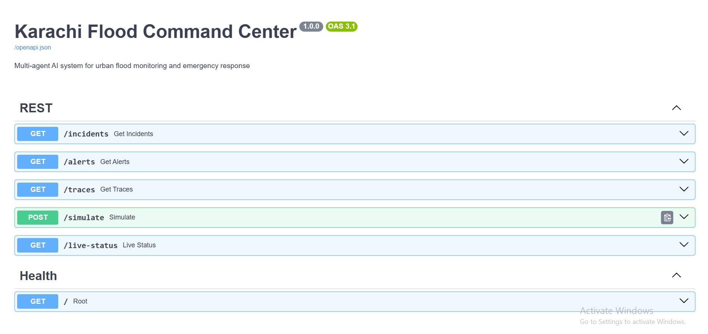
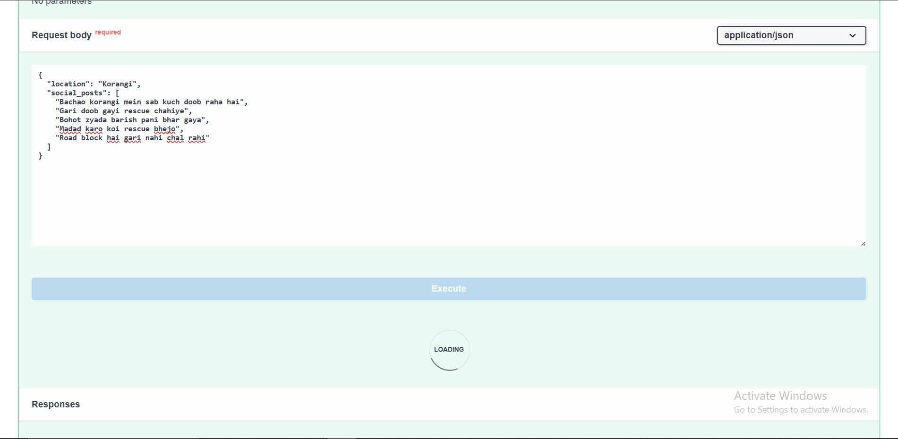
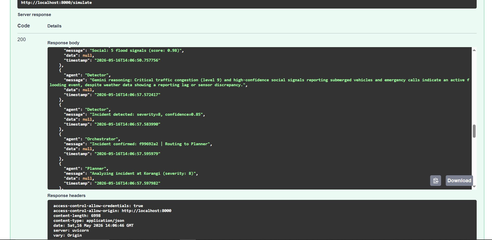

# Project CORE-KHI (Crisis Orchestration & Resilience Engine)

A high-fidelity, Autonomous Command Center designed to manage urban crises in Karachi. Powered by Google Antigravity and Gemini AI, this dual-engine architecture processes real-world data noise (Roman Urdu social signals, live telemetry) to orchestrate multi-agent responses for both **Monsoon Flooding** and **Summer Heatwave/Grid Failures**.

---

## How it works _ The CIRO Multi-Agent Architecture

Four specialized AI agents run in an autonomous, self-correcting loop:

```
[SIFTER]     → Ingests weather/temperature, traffic APIs, and parses Roman Urdu social signals.
      ↓
[STRATEGIST] → Cross-validates incidents, calculates population impact, and plans alternate routing.
      ↓
[VALIDATOR]  → Acts as a logic-gate to catch false alarms and prevent phantom dispatches.
      ↓
[COMMANDER]  → Generates targeted alerts, dispatches municipal services, and updates the UI map state.
```

---

## Project Structure

```
karachi-flood-command/
├── main.py
├── requirements.txt
├── .env.example
├── core/
│   ├── config.py
│   ├── orchestrator.py
│   └── state.py
├── agents/
│   ├── detector_agent.py
│   ├── planner_agent.py
│   └── executor_agent.py
├── tools/
│   ├── weather_tool.py
│   ├── traffic_tool.py
│   ├── social_signal_tool.py
│   ├── geofence_tool.py
│   ├── reroute_tool.py
│   └── alert_tool.py
├── services/
│   ├── firestore_service.py
│   └── websocket_service.py
├── models/
│   ├── incident.py
│   ├── plan.py
│   └── action.py
└── api/
    ├── routes.py
    └── websocket.py
```

---

## Setup & Installation

### Step 1 — Open the project folder

```powershell
cd karachi-flood-command
```

### Step 2 — Create a virtual environment

**Windows (PowerShell):**
```powershell
python -m venv venv
venv\Scripts\activate
```

**Mac/Linux:**
```bash
python3 -m venv venv
source venv/bin/activate
```

You should see `(venv)` in your terminal after activation.

### Step 3 — Install dependencies

```powershell
pip install -r requirements.txt
```

### Step 4 — Configure environment variables

```powershell
copy .env.example .env
```

Open `.env` and fill in your keys:

```env
GEMINI_API_KEY=your_gemini_api_key_here
METEOSOURCE_API_KEY=your_meteosource_api_key_here
TOMTOM_API_KEY=your_tomtom_api_key_here
FIREBASE_CREDENTIALS_PATH=./firebase-credentials.json
FIREBASE_PROJECT_ID=your_firebase_project_id
SIMULATION_MODE=false
```

> **Note:** The system works without TomTom and Firebase. Traffic falls back to mock data automatically, and storage uses in-memory if Firebase is not configured. Only `GEMINI_API_KEY` and `METEOSOURCE_API_KEY` are needed for real AI reasoning.

**Where to get keys:**
- Gemini: https://aistudio.google.com → Get API key (free)
- Meteosource: https://www.meteosource.com → Sign up → Dashboard
- Firebase (optional): https://console.firebase.google.com → Project Settings → Service Accounts → Generate Private Key → rename to `firebase-credentials.json` and place in project root

### Step 5 — Run the server

```powershell
uvicorn main:app --reload
```

Server starts at: **http://localhost:8000**

---

## Testing the API

### Option 1 — Swagger UI (Recommended)

Open your browser and go to:

```
http://localhost:8000/docs
```

You will see the full interactive API like this:



All endpoints are listed. Click any one to expand it.

---

### How to test via Swagger (step by step)

**1.** Open `http://localhost:8000/docs`

**2.** Click on `POST /simulate` to expand it

**3.** Click **"Try it out"** button (top right of the endpoint)

**4.** Paste one of the test inputs below in the Request Body field



**5.** Click **Execute**

**6.** Scroll down to see the full response with agent reasoning trace



The reasoning trace shows exactly what each agent decided and why.

---

## Test Inputs

Copy and paste any of these into the `/simulate` request body:

### Critical flood — Korangi
```json
{
  "location": "Korangi",
  "social_posts": [
    "Bachao korangi mein sab kuch doob raha hai",
    "Gari doob gayi rescue chahiye",
    "Bohot zyada barish pani bhar gaya",
    "Madad karo koi rescue bhejo",
    "Road block hai gari nahi chal rahi"
  ]
}
```
Expected: severity 8-10, `activate_emergency_ops` triggered, ticket dispatched

---

### Severe flood — Gulshan
```json
{
  "location": "Gulshan",
  "social_posts": [
    "Gulshan mein pani bhar gaya yaar",
    "Sab doob gaya gulshan mein rescue chahiye",
    "Gari phas gayi block 13 pe"
  ]
}
```
Expected: HIGH priority, reroute activated, Gemini-written alert message

---

### Medium severity — Nazimabad
```json
{
  "location": "Nazimabad",
  "social_posts": [
    "Road block hai nazimabad mein",
    "Tez barish ho rahi hai",
    "Traffic jam bohot zyada hai"
  ]
}
```
Expected: MEDIUM priority, advisory issued

---

### False alarm — DHA
```json
{
  "location": "DHA",
  "social_posts": [
    "Thodi barish ho rahi hai DHA mein",
    "Sab theek hai DHA mein abhi",
    "Barish band ho gayi"
  ]
}
```
Expected: no incident detected, workflow terminates early with false alarm classification

---

### No social posts (pure sensor data only)
```json
{
  "location": "Orangi Town"
}
```
Expected: system uses mock posts automatically, flood detected based on signals

---

### Multi-signal emergency — University Road
```json
{
  "location": "University Road",
  "social_posts": [
    "University Road pe pani bhar gaya yaar gari phas gayi",
    "Bohot zyada barish ho rahi hai uni road pe",
    "Road block hai university road koi alternative batao",
    "Help chahiye university road pe car doob gayi"
  ]
}
```
Expected: severity 8+, rerouting to Shahrah-e-Faisal Bypass

---

## API Endpoints

| Method | Path | Description |
|--------|------|-------------|
| GET | `/` | System health check |
| GET | `/incidents` | All detected incidents |
| GET | `/alerts` | All generated alerts |
| GET | `/traces` | Full agent reasoning traces |
| POST | `/simulate` | Trigger a flood simulation |
| GET | `/live-status` | Agent and system status |
| WS | `ws://localhost:8000/ws/live-trace` | Live reasoning stream |

---

## PowerShell Test Commands

```powershell
### Critical Heatwave & Grid Failure — I.I. Chundrigar
```json
{
  "location": "I.I. Chundrigar Road",
  "temperature_c": 44,
  "social_posts": [
    "Bohot shadeed dhoop hai chakkar aa rahe hain",
    "Chundrigar main transformer phat gaya, no light",
    "Heatstroke cases rising near financial district",
    "Traffic jam aur garmi se bura haal hai"
  ]
}
# Get all incidents
Invoke-RestMethod -Uri "http://localhost:8000/incidents"

# Get all alerts
Invoke-RestMethod -Uri "http://localhost:8000/alerts"

# Get reasoning traces
Invoke-RestMethod -Uri "http://localhost:8000/traces"

# Live status
Invoke-RestMethod -Uri "http://localhost:8000/live-status"
```

---

## Supported Locations

These locations can be used in the `location` field:

```
University Road    Gulshan          Nazimabad        Korangi
DHA                Saddar           Malir            North Karachi
Orangi Town        Lyari            Clifton          PECHS
Gulistan-e-Johar   FB Area          Liaquatabad      Landhi
Shah Faisal Colony Surjani Town     Baldia Town      Kemari
Garden             Sohrab Goth      Scheme 33        Bin Qasim
Model Colony       New Karachi      Mauripur         Johar More
Superhighway
```

---

## Agent Roles & Responsibilities

| Agent | Core Function | Uses Gemini AI? |
|-------|---------------|-----------------|
| **SIFTER** | Parses raw strings (e.g., *"pani khara hai"*, *"light nahi hai"*). Identifies location and crisis type (Flood vs. Heat). | Yes |
| **STRATEGIST** | Analyzes severity, queries traffic blockages, and formulates a localized response plan. | Yes |
| **VALIDATOR** | The safety layer. Rejects conflicting data (e.g., rejecting a flood alert if Meteosource shows 0mm rain). | Yes |
| **COMMANDER** | Executes the final JSON payload to trigger frontend map changes, SMS alerts, and geofences. | Yes |
---

## Simulation Mode vs Live Mode

| Feature | `SIMULATION_MODE=true` | `SIMULATION_MODE=false` |
|---------|----------------------|------------------------|
| Weather data | Hardcoded mock values | Live Meteosource API |
| Traffic data | Hardcoded mock values | TomTom (falls back to mock) |
| Social signals | Mock Roman Urdu posts | Posts sent via API request |
| Gemini reasoning | Disabled — rule-based scoring | Enabled — real AI reasoning |
| Storage | In-memory only | Saved to Firestore |

---

## Stopping the server

```powershell
Ctrl + C
```

Deactivate virtual environment:

```powershell
deactivate
```
